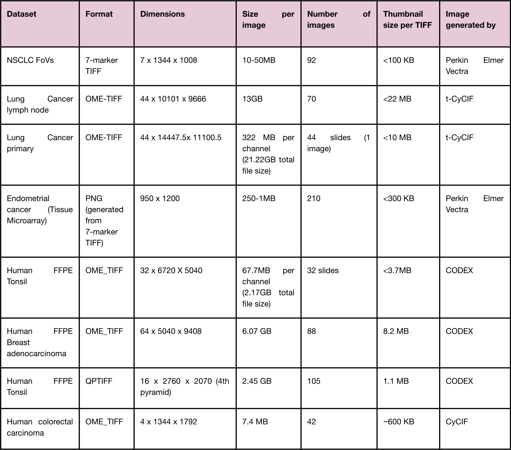
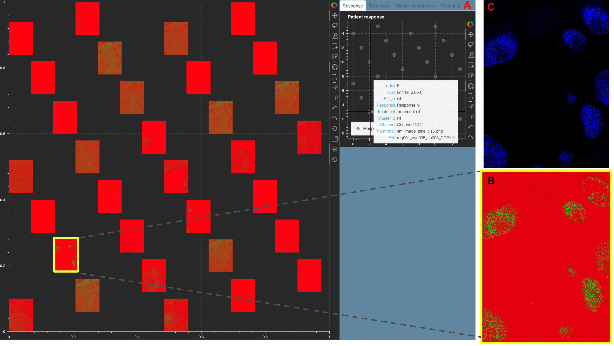
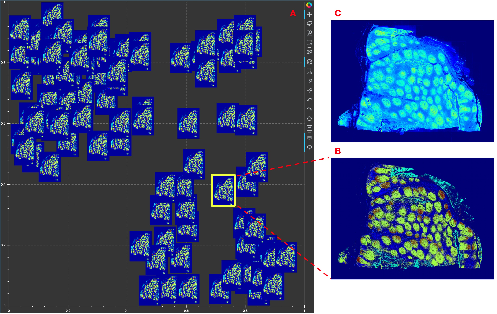

Mistic experiments
==================

Datasets used to test Mistic
----------------------------

..

..

Table listing the different datasets Mistic has been tested on.

Non-small cell lung cancer
--------------------------

.. image:: figures/nsclc_fov.jpg
   :width: 600
   :alt:
   :align: center
..

..

Figure showing Response 1 and Response 2 patients with NSCLC have significantly different cellular compositions. **A.** 2D t-SNE plot showing three clusters annotated with the differentially expressed markers per cluster. Clusters are obtained using the tumor-immune cell counts at the tumor border where the borders are estimated using convex hulls approximations. **B.** Same t-SNE as in (**A**) depicting the disease response spread. **C.** Image t-SNE using same t-SNE coordinates as in (**A**) illustrating the gradient of immune cells across images. A higher colocalization of immune cells (shown in green) is seen for Response 1 patients.
Instructions to run Mistic on a toy dataset is here: :doc:`vignette_example_vectra` 7.1.

Lung adenocarcinoma metastasis to lymph node
--------------------------------------------

.. image:: figures/lung_adeno.jpg
   :width: 600
   :alt:
   :align: center
..

..

Figure showing Mistic on the Lung adenocarcinoma lymph t-CyCIF data. The static canvas shows 70 repeats of the Lung t-CyCIF image arranged in rows. Mistic gives the composite image using 6 markers (CD45, Keratin, aSMA, FoXP3, PD-1, PD-L1). The live canvas shows proxy cluster assignments.
We discuss how to run Mistic on this data here: :doc:`vignette_example_tcycif` 6.1.

Primary lung squamous cell carcinoma
------------------------------------

.. image:: figures/lung_prim.jpg
   :width: 600
   :alt:
   :align: center

..

..

Figure showing a Stack Montage from Mistic for the Primary Lung t-CyCIF data with 44 markers. **A.** The static canvas shows all 44 markers and the live canvas shows the tSNE scatter plot. We identify the Keratin channel using the live canvas (shown with hover tool details) and highlight the Keratin thumbnail in yellow in the static canvas. **B.** The zoomed in Keratin thumbnail (file name obtained from the hover tool) and **C.** The t-CyCIF image for Keratin as viewed using Minerva [45]. Minerva provides the single marker views for 12 markers whereas with Mistic we can view all 44 channels as a montage.
We discuss how to run Mistic on this data here: :doc:`vignette_example_tcycif` 6.2.

Tissue Microarray cores for Endometrial cancer
----------------------------------------------

.. image:: figures/tma.jpg
   :width: 600
   :alt:
   :align: center
..

..

Figure showing **A.** Image tSNE rendering using Mistic for 210 Tissue Microarray (TMA) cores of Endometrial cancer. Each core depicts pIGr on tumor cells (blue), IgA (black), IgG (pink), plasma cells (red), additional B-cells (green) and unstained cells (gray). Each core has a border that matches the cluster it belongs to (see the Cluster annotations live panel). Representative cores from each of the clusters dominated by pIgr, IgA and IgG are shown. **B.** tSNE scatter plot showing the marker spread computed from the 210x5 count matrix prior to clustering.

Human FFPE Tonsil data
------------------------

..

..

Figure showing a Stack Montage from Mistic for the Human FFPE Tonsil CODEX data with 32 markers. **A.** The static canvas shows all 32 markers and the live canvas shows the tSNE scatter plot. We identify the CD21 channel using the live canvas (shown with hover tool details) and highlight the CD21 thumbnail in yellow in the static canvas. **B.** The zoomed in CD21 thumbnail (file name obtained from the hover tool) and **C.** The CODEX CD21 channel as viewed using FIJI. FIJI provides the single marker views for 32 markers whereas with Mistic we can view all 32 markers as a montage.

Human FFPE Breast adenocarcinoma
--------------------------------

.. image:: figures/codex_64.jpg
   :width: 600
   :alt:
   :align: center
..

..

Figure showing Mistic tested on the 64-channel Human FFPE Breast adenocarcinoma CODEX data. **A.** The static canvas shows 88 repeats of the CODEX image arranged in proxy user-generated tSNE co-ordinates. Mistic gives the composite image using 7 markers (Keratin14, FoxP3, CD34, CD8, CD3e, CD68 and Perlecan). **B.** The zoomed in composite thumbnail generated by Mistic and **C.** The CODEX image for Keratin19, CD8, CD3e, Vimentin, CD68 and CollagenIV. Note that with Mistic we can view any number of markers at once.

Human FFPE Tonsil demo data from Akoya
--------------------------------------

..

..

Figure showing Mistic tested on the 16-channel Human FFPE Tonsil CODEX pyramidal TIFF (QPTIFF) data provided to us by Akoya Biosciences. Note that we read in all the five image pyramids in the file and use the fourth image pyramid for rendering in Mistic. **A.** The static canvas shows 105 repeats of the CODEX image arranged in proxy user-generated tSNE co-ordinates. Mistic gives the composite image using 6 markers (PanCK, CD31, SMA, Ki67, CD8 and CD20). **B.** The zoomed in composite thumbnail generated by Mistic and **C.** The CODEX image for PanCK, CD31, Ki67 and CD20 rendered using QuPath [21]. Note that with Mistic we can view any number of markers at once.

Human Colorectal carcinoma
--------------------------

.. image:: figures/colon_carcinoma_mistic.png
   :width: 600
   :alt:
   :align: center
..

..

Figure showing  Mistic tested on 4-channel Human colorectal carcinoma CyCIF (OME-TIFF) images [53]. **A.** The static canvas shows 42 duplicates of the three CyCIF images (DAPI, CD3, CD4, CD8, CD20, CD68, FoxP3) are rendered randomly. **B-D.** The zoomed-in composite thumbnails generated by Mistic for the three CyCIF images.
