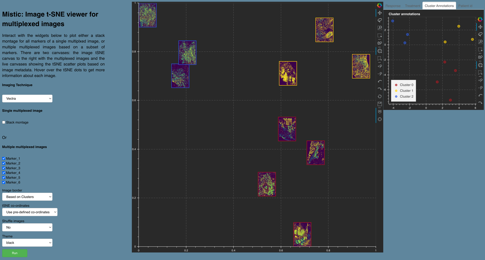

Vignettes on Vectra data
========================

We provide a toy dataset to run Mistic on the NSCLC Vectra FoVs. Check out our :doc:`mistic_exp` page for examples Mistic has been tested on and :doc:`function_flowchart` for a full list of functions Mistic uses. 

PerkinElmer Vectra based NSCLC FoVs 
***********************************

Each Vectra image is in TIFF format, is up to 43MB in size with dimensions 1344 x 1008, and has 7 marker channels.

* Download Mistic as described here :doc:`install`

	* Navigate to ``Mistic_code/code/user_inputs/``

* Download data from 

	* ``https://doi.org/10.5281/zenodo.6131933``

	*  Place it in the /user_inputs/figures/ folder

* Navigate to the /user_inputs/metadata folder

	* Upload the imaging markers of interest as Markers_ids.csv

		* A sample .csv is provided in the /metadata folder

	* Upload the markers.csv which is the entire set of markers for that dataset

		* A sample .csv is provided in the /metadata folder
  
  	* Optional uploads: 
    
   		 * Image tSNE co-ordinates as X_imagetSNE.csv
   
			* If no user-generated tSNE co-ordinates are provided, Mistic will generate a set of random coordinates to render the images
 
    		 * Cluster labels as Cluster_categories.csv
      
      		 * Patient_ids as Patient_ids.csv
      
   	         * Treatments as Treatment_catgories.csv
      
                 * Patient response as Response_categories.csv 

		 * If any of these are unavailable, Mistic will use either the randomly-generated or user-provided tSNE points without any color coding i.e. dots are colored in gray, for the live panels. 
     
    	         * Sample metadata files are provided for reference in the /metadata folder 

* Open a command prompt (or the Terminal application), change to the directory containing /code and type
  
   * ``pip install -r requirements.txt``  
   * ``bokeh serve --port 5098 --show image_tSNE_GUI``
   * This runs a bokeh server locally and will automatically open the interactive dashboard in your browser at http://localhost:5098/image_tSNE_GUI

* From the GUI, choose 'Vectra' from the dropdown menu, check the boxes for markers of interest and select other options based on image metadata (for example, border, image layout) and click 'Run'

..

..

Figure showing Mistic's output on toy data based on user inputs. The static canvas renders the image t-SNE and the live canvas shows the t-SNE scatter plot for cluster annotations. Each image border is colored based on cluster identity.
